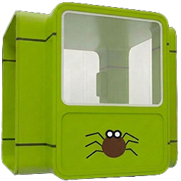

  
  <h1>Kiosk TypeScript App Foundation</h1>

  A flexible and lightweight foundation for building modern kiosk applications.

Foundational library for K67 (the next Kiosk with integrated Recording App)
